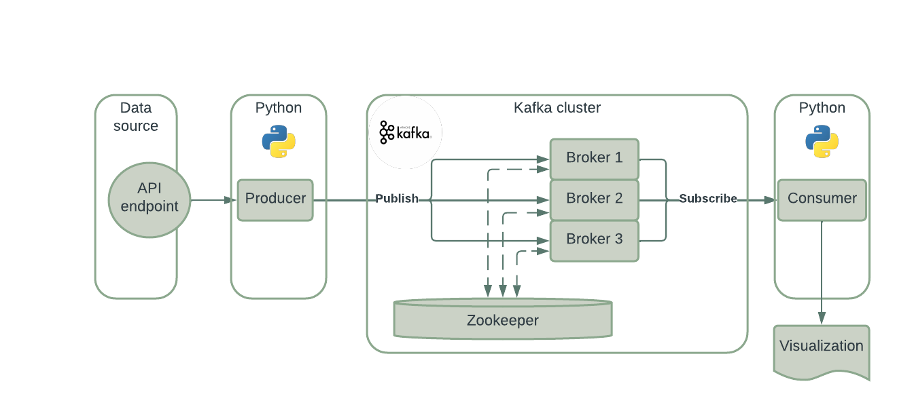

# Kafka Finnhub demo

This is a sample project on Apache Kafka. Finnhub is used as a data source and the overall result produces a self updating real-time visualization on the stock market data stream:   

<!--  -->


# Table of Contents
- [Kafka Finnhub demo](#kafka-finnhub-demo)
- [Table of Contents](#table-of-contents)
- [Technical documents](#technical-documents)
  - [Project content](#project-content)
  - [Data flow](#data-flow)
  - [Setup](#setup)
- [Useful links](#useful-links)


# Technical documents
## Project content
```
.
├── docker                          # Docker compose of the overall setup
├── imgs                            # Static files for documentation
├── kafka                           # Kafka producer and consumer scripts
├── test
|    └── api/finnhub
|        ├── secrets.py             # API tokens and other secrets
|        ├── test_api.py            # REST API sample script
|        └── test_websocket.py      # Websocket sample script
├── .gitignore
├── LICENCE
├── README.md
└── requirements.txt                # Python requirements
```


## Data flow
The architecture consists of typical Apache Kafka consumer - producer model:
1. Finnhub websocket API acts as a streaming data source.
2. Producer subscribes to the API and publishes event data to a defined Kafka topic.
3. Zookeeper handles Kafka connections through scalable brokers.
4. Consumer subscribes to a defined topic and read the event data.
5. As an example, a real-time visualization is produced as an output.




## Setup
1. Install [requirements](requirements.txt): `pip install -r requirements.txt`.
2. Start the [containers](docker/README.md).
3. Setup connection and [test it](test/api/finnhub/README.md).
4. Start [consumer and producer](kafka/README.md).


# Useful links
Here is a collection of additional information on the topic:
- Kafka
  - Introduction:
    https://www.gentlydownthe.stream/
  - Getting started with Kafka:
    https://towardsdatascience.com/getting-started-with-apache-kafka-in-python-604b3250aa05
  - Kafka topic creation tutorial:
    http://cloudurable.com/blog/kafka-tutorial-kafka-from-command-line/index.html
  - Kafka producar-consumer example:
    https://github.com/kadnan/Calories-Alert-Kafka
- Kafka Docker
  - Kafka Docker implementation:
    https://towardsdatascience.com/kafka-docker-python-408baf0e1088
  - Kafka Docker tutorial:
    https://towardsdatascience.com/kafka-docker-python-408baf0e1088
  - Container link for wurstmeister Kafka container:
    https://hub.docker.com/r/wurstmeister/kafka/
  - Container link for bitnami Kafka container:
    https://hub.docker.com/r/bitnami/kafka/
- Finnhub
  - Used API connector documentation:
    https://github.com/Finnhub-Stock-API/finnhub-python
