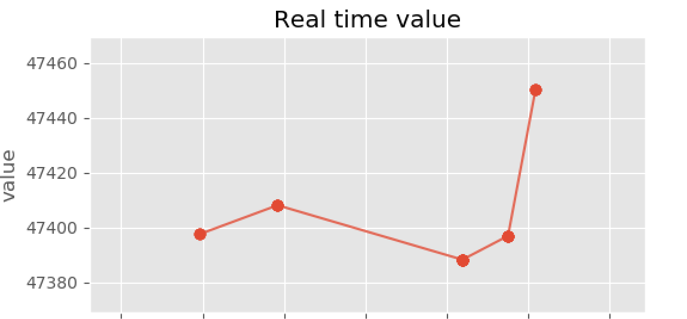

# Kafka Finnhub demo

This is a sample project on Apache Kafka. Finnhub is used as a data source and the overall result produces a self updating real-time visualization on the stock market data stream:   

<!--  -->

# Table of Contents
- [Kafka Finnhub demo](#kafka-finnhub-demo)
- [Table of Contents](#table-of-contents)
- [Useful links](#useful-links)

# Useful links
Here is a collection of additional information on the topic:
- Kafka
  - Introduction:
    https://www.gentlydownthe.stream/
  - Getting started with Kafka:
    https://towardsdatascience.com/getting-started-with-apache-kafka-in-python-604b3250aa05
  - Kafka topic creation tutorial:
    http://cloudurable.com/blog/kafka-tutorial-kafka-from-command-line/index.html
  - Kafka producar-consumer example:
    https://github.com/kadnan/Calories-Alert-Kafka
- Kafka Docker
  - Kafka Docker implementation:
    https://towardsdatascience.com/kafka-docker-python-408baf0e1088
  - Kafka Docker tutorial:
    https://towardsdatascience.com/kafka-docker-python-408baf0e1088
  - Container link for wurstmeister Kafka container:
    https://hub.docker.com/r/wurstmeister/kafka/
  - Container link for bitnami Kafka container:
    https://hub.docker.com/r/bitnami/kafka/
- Finnhub
  - Used API connector documentation:
    https://github.com/Finnhub-Stock-API/finnhub-python
